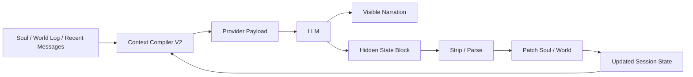

# 전세계 개발 블로그와 데브로그 리서치

## 요약

좋은 devlog는 대체로 글을 “설명”으로 시작하지 않고, 이번에 밀어 넣은 기능·버그·전환점으로 바로 시작한다. Spellbound, Ghostty, Airport CEO, SANG MIN’s 글은 첫머리에서 바로 이번 작업의 물건을 까고, Factorio와 Godot는 개인 고백을 줄이는 대신 섹션 구조로 그 역할을 대신한다. 반대로 Rust, Valheim, Apex, Tauri stable 같은 글은 정보 전달은 훌륭하지만 플레이어/사용자 대상 브리핑 톤이 더 강해서, 네가 원하는 “커밋 직후 1인칭 기술 로그”와는 결이 다르다. 네 방향에 가장 잘 맞는 조합은 **Ghostty의 1인칭 기술 서술**, **한국어 개인 devlog들의 저장소 연속성**, 그리고 **Factorio·Godot의 섹션 discipline**이다. citeturn17view3turn19view0turn17view1turn20view1turn16view1turn22view0turn17view2turn17view0turn15view0

## 사례 분석

1. **Spellbound: November Update** — slayemin / GameDev.net, 2016-12-01  
   URL: `https://gamedev.net/blogs/entry/2262462-spellbound-november-update`  
   Oculus Rift + Touch 통합, Vive 호환, 손가락 제스처, 몸통 방향 계산 개선 같은 일을 한 달의 생활사와 같이 묶어 쓴다. 톤은 날것의 1인칭이고, 구조는 거의 무제목 산문형이라 섹션 discipline은 약하지만, 첫 문단에서 바로 “이번 달에 뭘 만들었는지 / 왜 늦었는지 / 어디가 풀렸는지”가 튀어나온다. 길이는 중간 정도이며 페이지에 8분 읽기 표기가 있고, 시각자료는 영상 1개 정도, 코드·커밋 링크는 거의 없다. 효과적인 이유는 깔끔해서가 아니라 “지금 막 개발 중인 사람”의 온도가 그대로 남아 있기 때문이다. 네 스타일과의 궁합은 **중상**이다. 훅과 솔직함은 아주 좋지만, 그대로 따라가면 문단 초점이 쉽게 퍼진다. citeturn11view0turn17view3

2. **Crafting Update** — Rust / Facepunch, 2025-03-06  
   URL: `https://rust.facepunch.com/news/crafting-update`  
   Cooking Workbench, Chicken Coop, Food Spoiling처럼 기능을 기능 단위 섹션으로 잘게 쪼개고, 거의 모든 덩어리에 이미지가 붙는 라이브서비스형 devblog다. 톤은 친근하지만 기본적으로는 플레이어 대상 업데이트 안내이고, 길이는 매우 길며 스크롤형 소비에 최적화되어 있다. 시각자료는 매우 많고, 반대로 코드·커밋 링크는 거의 없다. 효과적인 이유는 “한 섹션당 한 기능” 원칙이 명확하기 때문이다. 네 쪽에 가져올 건 **섹션 쪼개기와 이미지 배치**이고, 그대로 따라가면 톤이 너무 유저 공지문처럼 된다. citeturn11view1turn17view2

3. **Friday Facts #440 - 2.1 plan** — Klonan / Factorio, 2026-05-29  
   URL: `https://www.factorio.com/blog/post/fff-440`  
   시작은 짧고, 곧바로 `2.1 plan → Scope and expectations → Current state → The next step → And in the long term?`로 넘어간다. 이미지가 아주 많지는 않지만 플레이테스트 결과를 보여주는 스크린샷이 적절하게 들어가고, 길이는 짧음과 중간 사이, 코드·커밋 링크는 거의 없다. 효과적인 이유는 “이번 포스트의 의제”가 하나로 고정되고, 기대치 조절을 매우 잘한다는 점이다. 개인적인 거친 맛은 적지만, 구조를 배우기에는 최고급 레퍼런스다. 네 스타일과의 궁합은 **상**이다. 목소리는 덜 가져오고, 섹션 discipline을 가져오면 좋다. citeturn13view0turn16view1turn25view0

4. **Zaumby Thursday** — Project Zomboid 팀, 2024-02-29  
   URL: `https://projectzomboid.com/blog/news/2024/03/zaumby-thursday/`  
   “Lots of stuff from lots of different areas”라는 인사 뒤에 바로 `### STRIKE A POSE`, `### GRASSED ME RIGHT UP` 같은 소제목 리듬이 붙고, before/after 성격의 이미지가 많이 들어간다. 톤은 팀 보이스이지만 딱딱하지 않고, 길이는 긴 편이며, 코드·커밋 링크는 거의 없다. 효과적인 이유는 텍스트만 읽어도 무슨 개선인지 보이고, 이미지를 보면 더 빨리 이해된다는 점이다. 네 스타일과의 궁합은 **상**이다. “여러 기능을 한 글에 넣더라도 섹션 리듬과 시각증거로 버틴다”는 걸 잘 보여준다. citeturn13view1turn16view0turn25view1

5. **Word From the Devs: Yeah, That’s A Drawbridge** — Iron Gate team / Valheim, 2026-04-28  
   URL: `https://www.valheimgame.com/news/word-from-the-devs-yeah-that-s-a-drawbridge/`  
   짧은 농담성 도입 뒤에 Deep North 음식 티저, drawbridge 공개, `Build of the Month`로 빠르게 넘어가는 짧은 커뮤니티형 글이다. 이미지 비중이 높고 길이는 짧으며, 코드·커밋 링크는 없다. 효과적인 이유는 한 화면 안에 “이번 달에 보여줄 물건”이 분명하다는 점이다. 다만 기술 devlog라기보다는 커뮤니티 티저에 가깝다. 네 스타일과의 궁합은 **중하**다. 이미지 운용은 참고할 만하지만, 목소리와 정보 밀도는 네 쪽보다 훨씬 가볍다. citeturn13view2turn17view0

6. **Dev Blog 156: The Emergency Update released and a new development paradigm** — Airport CEO 팀, 2020-09-09  
   URL: `https://www.airportceo.com/post/dev-blog-156-the-emergency-update-released-and-a-new-development-paradigm`  
   이 글은 “베타로 넘어간다”는 전환점을 하나의 운영 변화로 잡고, 스프린트와 daily update, bi-weekly release cadence를 도식과 함께 설명한다. 길이는 중간, 이미지/도식은 적지만 핵심 타이밍에 들어가고, 코드·커밋 링크는 거의 없다. 효과적인 이유는 추상적인 “개발 방식이 바뀐다”를 바로 구체적인 배포 주기로 바꾸기 때문이다. 네 스타일과의 궁합은 **상**이다. 단, 여기서 배울 건 PM 톤이 아니라 **한 글에 한 전환점** 원칙이다. citeturn13view3turn17view1

7. **Dwarf Fortress Development Log** — Toady One / Bay 12 Games, 누적형 로그  
   URL: `https://www.bay12games.com/dwarves/`  
   이건 개별 포스트보다 “홈에 계속 누적되는 개발 로그” 시스템 자체가 레퍼런스다. 월간 report와 `Future of the Fortress` 답변, routine patch, 소소한 생활사, 장기 로드맵이 한 축으로 이어지고, 2024년 11월 로그처럼 “결혼 때문에 밀렸지만 보고서 두 개는 올렸다” 수준의 거친 생활감도 남는다. 길이는 연속형이라 사실상 매우 길고, 이미지와 외부 report 링크는 많지만 commit 링크는 없다. 효과적인 이유는 몇 년치 축적이 곧 신뢰가 된다는 점이다. 네 스타일과의 궁합은 **상**이다. “조금 거칠어도 연속성이 있으면 된다”는 쪽에서 특히 강하다. citeturn23view0turn26view0

8. **게임개발일지[0]-팀구성과 기획** — SANG MIN’s, 2024-07-01  
   URL: `https://sangmin2ya.github.io/gamedevelog/unityengine/ALAN_0/`  
   “3달간 프로젝트 기록 겸 회고록”이라고 선언하고, 바로 `2024.03.26 첫 커밋`과 `2024.06.22 최종 Release 1.0.0 배포`를 박아 넣는다. 그 다음 팀 모집, 초기 기획, 결정으로 넘어가니, 추상적인 기획 글인데도 땅에 잘 붙어 있다. 길이는 중간, 영상·배포 링크가 있고, 커밋 링크는 직접적이지 않지만 일정 anchor가 강하다. 효과적인 이유는 일정·레포·배포라는 실물 좌표가 있어 글이 뜨지 않는다는 점이다. 네 스타일과의 궁합은 **상**이다. 한국어로 “커밋 직후 목소리”를 살릴 때 좋은 기준점이다. citeturn20view1

9. **GG 스튜디오 개발 일지 [7]** — Blue log, 2025-01-23  
   URL: `https://fkdl0048.github.io/game/game_18/`  
   “오랜만에 썼다”는 솔직한 문장 다음에 바로 프로젝트 상태를 `안정된 프로젝트 / 불안한 프로젝트 / 정리`로 나눈다. 레포 링크와 이전 개발일지 링크가 같이 붙어 있어서, devlog가 개별 글이 아니라 프로젝트 메모리로 작동한다. 길이는 중간, 시각자료는 많지 않지만 저장소/연속 링크가 강하고, 코드 스니펫은 없다. 효과적인 이유는 수사보다 축적이 우선인 구조다. 네 스타일과의 궁합은 **상**이다. 너처럼 시리즈로 밀고 가는 글에는 특히 잘 맞는다. citeturn13view12turn16view7

10. **Ghostty Devlog 005** — Mitchell Hashimoto, 2023-12-06  
    URL: `https://mitchellh.com/writing/ghostty-devlog-005`  
    이 글은 네가 가져와야 할 레퍼런스 1순위다. 표면은 “welcome”으로 시작하지만 곧바로 `Community Updates`, `Asian Language Input`, `Chinese Character Alignment (#982)`, `Custom Shaders (#903)`로 들어가고, 각 섹션은 실제 문제·이슈 번호·이미지·외부 라이브러리 링크를 가진다. 길이는 중간, 시각자료는 기능 이해용으로 딱 필요한 만큼, 코드·이슈 링크는 중간 이상이다. 효과적인 이유는 **1인칭인데 구조가 흐트러지지 않는다**는 점이다. 네 스타일과의 궁합은 **최상**이다. 기분, 기술, 현재진행형, 섹션 감각이 가장 잘 섞여 있다. citeturn13view4turn19view0turn19view1turn19view2turn25view2

11. **bun.report is Bun’s new crash reporter** — Chloe Caruso / Bun, 2024-04-26  
    URL: `https://bun.sh/blog/bun-report-is-buns-new-crash-reporter`  
    하나의 기술 문제를 정확히 잡고, 왜 기존 OS crash reporter가 애매한지, 디버그 심볼 용량이 어느 정도인지, 어떤 포맷을 새로 만들었는지를 숫자와 코드, 이미지로 푼다. 길이는 중간~긴 편, 시각자료와 코드 스니펫이 둘 다 들어가고, 리포지터리/이슈 맥락도 연결된다. 효과적인 이유는 “한 글=한 문제=한 해결책”이 철저하기 때문이다. 네 스타일과의 궁합은 **상**이다. 특히 한 기능/한 버그를 깊게 파는 편에서 배울 점이 많다. citeturn13view6turn19view6

12. **Parallax2D Progress Report** — Mark DiBarry / Godot, 2024-04-02  
    URL: `https://godotengine.org/article/parallax-progress-report/`  
    `A fresh start`, `Why the change?`처럼 단정한 제목 아래에서 새 노드 이름, 구 노드 이름, 마이그레이션 방법, 편집기 내 변환 과정까지 전부 editor-visible한 언어로 설명한다. 길이는 중간, 변환 스크린샷이 있고, 코드·커밋 링크는 많지 않다. 효과적인 이유는 추상적인 설계 이유를 언제나 “사용자 눈에 보이는 변화”로 다시 끌고 내려온다는 점이다. 네 스타일과의 궁합은 **상**이다. 기술 설명을 깔끔히 정리하는 법을 배울 수 있다. citeturn13view7turn22view0turn25view3

13. **This month in Servo: new CSS units, color emoji, servoshell, and more!** — Servo, 2024-05-30  
    URL: `https://servo.org/blog/2024/05/30/this-month-in-servo/`  
    월간 리캡 형식으로, 항목마다 GitHub 핸들·PR 번호·날짜·테스트 지표를 붙인다. 길이는 중간, 스크린샷이 있고, 코드/PR 링크 밀도는 이번 표본 중 최상급이다. 효과적인 이유는 스캔이 빠르고, “누가 무엇을 어느 PR로 넣었는지”가 즉시 보인다는 점이다. 네 스타일과의 궁합은 **중상**이다. 글맛은 다소 뉴스레터에 가깝지만, `Covered commits` 감각을 본문까지 끌어올리는 데 참고하기 좋다. citeturn13view9turn22view1

14. **Tauri 2.0 Release Candidate** — Tauri 팀, 2024-08-01  
    URL: `https://v2.tauri.app/blog/tauri-2-0-0-release-candidate/`  
    “모바일 first-class citizen이라고 과하게 기대하게 만들고 싶지 않다”는 식으로 한계를 먼저 말하고, 바로 stable까지의 일정, breaking changes, migration command, permission naming 문제를 길게 풀어낸다. 길이는 긴 편이고, 코드 블록과 GitHub 링크가 많다. 효과적인 이유는 희망회로보다 실제 마이그레이션을 우선해 독자를 움직이게 만든다는 점이다. 네 스타일과의 궁합은 **중상**이다. 개인적인 거친 맛은 약하지만, 솔직한 expectation management와 실무 링크는 매우 좋다. citeturn15view2turn16view6turn22view2

## 내 방향과의 비교

내가 이전 004 초안에서 크게 잘못 잡은 건 세 가지였다. 첫째, 좋은 devlog들이 거의 다 처음 3~5줄 안에 “이번에 바뀐 물건”을 던지는데, 나는 `Context Compiler`의 철학부터 길게 깔아버렸다. Spellbound는 VR 입력 통합을 바로 꺼내고, Ghostty는 곧바로 beta·IME·shader 이야기를 시작하며, Airport CEO는 베타 스프린트 주기를 첫 화면에 올린다. SANG MIN’s 글은 아예 첫 커밋과 release 날짜부터 박는다. 둘째, 좋은 글은 devlog 자체를 설명하지 않는다. 길어도 곧장 작업물로 들어간다. 셋째, 좋은 글은 추상 얘기를 하더라도 두세 문장 안에 클래스 이름, 기능 이름, 스크린샷, 일정, PR, issue 번호 같은 `artifact`를 다시 들이민다. 내 이전 초안은 그 밀도가 너무 낮았다. citeturn17view3turn19view0turn17view1turn20view1turn22view0turn22view2

| 항목 | 좋은 사례에서 보인 패턴 | 네 스타일 기준 | 이전 초안에서 고칠 점 |
|---|---|---|---|
| 오프닝 | 첫 3~5줄 안에 이번에 만든 것·깨진 것·전환점을 바로 깐다. Spellbound, Ghostty, Airport CEO, SANG MIN’s가 전부 그렇다. citeturn17view3turn19view0turn17view1turn20view1 | 철학 서론 금지. 기능, 버그, 테스트 결과, 커밋 중 하나로 바로 시작 | Context theory를 너무 앞에 뒀음 |
| 시점 | “지금 해봤더니 이렇다”의 현재진행형이 강하다. Dwarf Fortress, Ghostty, GG는 축적 중인 프로젝트의 체온이 남아 있다. citeturn26view0turn19view0turn16view7 | hindsight verdict보다 running note | 지나치게 회고록처럼 보였음 |
| 추상도 | Factorio, Godot, Bun, Tauri RC는 추상 이유를 말해도 클래스명·API·마이그레이션 명령·기능 이름이 먼저 나온다. citeturn16view1turn22view0turn19view6turn22view2 | 개념어는 artifact 뒤에 온다 | “context architecture”가 evidence보다 앞섰음 |
| 문장 리듬 | 반복 대신 섹션과 사례로 리듬을 만든다. PZ는 before/after 이미지, Ghostty는 이슈별 분기, Factorio는 소제목 전환이 뚜렷하다. citeturn25view1turn19view1turn16view1 | 같은 문장 틀 2회 초과 금지 | `A ___ can still ___` 식 반복이 과했음 |
| 시각자료 | PZ, Rust, Godot, Airport CEO, Tauri stable는 텍스트가 빽빽해질 곳에 이미지나 도식을 넣는다. citeturn25view1turn17view2turn25view3turn17view1turn19view7 | 최소 2장: 앱 스크린샷 + 흐름도 또는 before/after | 텍스트만 길었음 |
| 코드·링크 | Servo, Tauri RC, Ghostty, Bun은 PR/이슈/명령어/외부 라이브러리 링크 밀도가 높다. citeturn22view1turn22view2turn19view2turn19view6 | `Covered commits`를 본문 artifact와 연결 | 커밋 섹션만 있고 본문 연결이 약했음 |
| 톤 | Ghostty·GG·SANG MIN’s·Spellbound는 1인칭이고 약간 거칠다. Rust·Valheim·Apex는 더 커뮤니티/사용자 브리핑 쪽이다. citeturn19view0turn16view7turn20view1turn17view3turn17view2turn17view0turn21view0 | 1인칭, 직설, 약간의 거친 온도 유지 | 너무 정리체/설명체로 갔음 |
| 엔딩 | Airport CEO, Factorio, Tauri RC는 다음 배포 압력·다음 단계·일정을 남기고 끝난다. citeturn17view1turn16view1turn16view6 | 철학적 결론보다 next constraint | “의미 정리”가 너무 길었음 |

네 방향에 제일 잘 맞는 참고 조합은 아래 여섯 개다.

| 우선순위 | 레퍼런스 | 가져올 것 |
|---|---|---|
| 1 | Ghostty Devlog 005 citeturn19view0turn19view1turn19view2 | 1인칭 현장감 + 섹션 discipline + issue anchor |
| 2 | GG 스튜디오 개발 일지 [7] citeturn16view7 | 한국어에서 자연스러운 거친 톤 + 시리즈 연속성 |
| 3 | 게임개발일지[0]-팀구성과 기획 citeturn20view1 | 첫 커밋/릴리스 같은 땅에 닿는 좌표 |
| 4 | Spellbound: November Update citeturn17view3 | 솔직함, 바로 작업물 들어가는 훅 |
| 5 | Friday Facts #440 citeturn16view1turn25view0 | 섹션 구조, 기대치 관리 |
| 6 | Parallax2D Progress Report citeturn22view0turn25view3 | 기술 설명을 사용자 눈높이 artifact로 내리는 법 |

## 바로 쓸 수 있는 템플릿

네 글에는 **Ghostty + 한국어 개인 devlog + Factorio/Godot의 구조감**이 제일 잘 맞는다. 즉, 목소리는 1인칭으로 가고, 구조는 차갑게 정리하고, 설명은 artifact 뒤에 붙이는 쪽이다. citeturn19view0turn16view7turn20view1turn16view1turn22view0

```markdown
# 004, [이번에 바뀐 행동/흐름]
## [짧은 부제: 기능명 2~3개 또는 문제 축]

[문단 1]
이번에 손댄 건 뭐였는지 바로 적는다.
커밋 직후 기준으로 어떤 문제가 있었는지 적는다.

[문단 2]
왜 이걸 지금 건드렸는지 적는다.
추상 설명 전에 파일, 기능, UI, 버그, 모델 행동 같은 실물을 넣는다.

### 이번에 넣은 것
- 기능/변경 1
- 기능/변경 2
- 기능/변경 3

### 왜 이게 필요했나
[최근 테스트에서 드러난 문제]
[이전 방식이 어디서 무너졌는지]

### 어떻게 굴러가나
[짧은 흐름 설명]
[스크린샷 1장 또는 mermaid 1개]

### 이번에 드러난 문제
[버그/경계조건/이상한 출력]
[다음에 손대야 할 부분]

### 커버한 커밋
1. `...`
2. `...`
3. `...`

### 다음
[다음에 부딪힐 제약/작업]
```

이 템플릿에서 중요한 건 “멋있는 서론”이 아니라 **첫 두 문단 안에 실물이 나오느냐**다. 문단 길이는 웹 기준 3~6문장 정도가 가장 안정적이고, 한 문단 안에서 논점은 하나만 잡는 편이 좋다. 너무 길어지면 Ghostty나 Factorio처럼 소제목으로 자르고, 너무 설명적이 되면 GG/SANG MIN’s처럼 일정·레포·빌드 좌표를 다시 넣어 글을 바닥에 붙이면 된다. citeturn19view0turn16view1turn16view7turn20view1

### 제목과 부제 포맷

제목은 **숫자 + 이번에 바뀐 동사/흐름**으로 가는 게 제일 강하다.

| 용도 | 추천 형식 | 예시 |
|---|---|---|
| 제목 | `004, [행동/흐름]` | `004, 전체 채팅 대신 세션 패킷` |
| 부제 | `[핵심 키워드 2~3개]` | `Context Compiler V2, 입력 정리, 상태 주입` |
| 다음 편 예고 | `[다음 제약/다음 문제]` | `패치 프로토콜과 상태 변경 추적` |

### 이미지와 다이어그램 배치

이미지는 많이보다 **제자리에**가 더 중요하다.

| 위치 | 무엇을 넣을지 | 목적 |
|---|---|---|
| 첫 섹션 끝 | 앱 스크린샷 1장 | “지금 뭐가 바뀌었는지” 즉시 보여주기 |
| `어떻게 굴러가나` | 흐름도 1개 | 문단을 덜 설명적으로 만들기 |
| `이번에 드러난 문제` | before/after 또는 debug panel 1장 | 실패가 추상이 아니라 실물이라는 걸 보여주기 |

### 한국어 문장 예시

아래 문장들은 네가 원하는 톤에 맞춰 바로 가져다 써도 되는 수준으로 잡았다.

| 상황 | 이렇게 쓰면 맞다 |
|---|---|
| 오프닝 | `이번에 손댄 건 input 쪽이다. hidden state는 이제 돌아가기 시작했는데, 다음 턴에 모델한테 뭘 먹일지는 아직 정리가 덜 되어 있었다.` |
| raw chat 문제 | `처음부터 채팅 로그를 끝까지 끌고 가고 싶었던 건 아니다. 그렇다고 요약 한 덩어리만 던지고 continuity가 유지되길 기대한 것도 아니다.` |
| recent chat vs state | `최근 대화만 있으면 말맛은 남는다. 대신 세션이 금방 빈다. 반대로 상태만 보내면 이어지긴 하는데 방금 전 장면의 온도가 빠진다.` |
| Soul/World 분리 | `Soul이 파일에 잘 저장돼 있다고 끝이 아니다. 모델이 다음 응답 전에 읽을 수 있는 패킷으로 바뀌어야 그제야 기억이 된다.` |
| 구조 설명 | `이건 프롬프트 미사여구보다 배선 작업에 가깝다.` |
| 버그/위험 | `패킷이 틀리면 다음 장면도 틀어진다.` |
| 다음 단계 연결 | `여기까지 오니까 patch protocol이 바로 필요해졌다.` |
| 엔딩 | `이제 보내는 쪽과 읽는 쪽은 둘 다 돌아가기 시작했다. 다음은 그 사이에서 바뀐 걸 제대로 남기는 일이다.` |

## 004 재작성 초안

# 004, 전체 채팅 대신 세션 패킷

## Context Compiler V2, 입력 정리, 그리고 상태 주입

hidden state 경로가 돌아가기 시작하니까 다음으로 밀린 게 input 쪽이었다.

모델 응답에서 숨겨진 블록을 떼어내고 Soul이랑 World를 갱신하는 건 이제 얼추 모양이 났다. 그런데 다음 턴에 모델이 뭘 보고 써야 하는지는 아직 정리가 덜 되어 있었다.

애초에 내가 원한 건 채팅 로그를 끝까지 질질 끌고 가는 방식이 아니었다. 그렇다고 요약 한 덩어리만 던지고 continuity가 유지되길 기대한 것도 아니다. 필요했던 건 raw chat 대신 계속 갱신되는 세션 패킷이었다.

### 이번에 넣은 것

Context Compiler V2를 올리면서 다음 턴 payload를 좀 더 의도적으로 만들기 시작했다.

지금 장면의 상태.  
캐릭터가 들고 가는 기억.  
최근 사건.  
관계 압력.  
월드 쪽 정보.  
그리고 최근 메시지 몇 개.

이번엔 그걸 그냥 나열하는 게 아니라, 실제로 API payload에 들어갈 입력으로 정리하는 쪽에 초점을 뒀다.

최근 채팅은 여전히 필요하다. 말맛이 거기 있기 때문이다. 방금 직전의 어감, 호흡, 누가 어떤 온도로 말을 던졌는지는 요약만으로 잘 안 남는다.

반대로 최근 대화만으로는 세션이 금방 빈다. 몇 턴만 지나도 중요한 감정 변화, 깔려 있는 관계, 방 안의 상태, 장면 바깥의 세계 정보가 금방 날아간다.

그래서 둘 다 넣었다. 최근 채팅은 흐름을 살리고, 구조화된 상태는 연속성을 들고 간다.

### 왜 이렇게 갔는가

`Soul` 과 `World Log`를 나눈 건 이미 해둔 일이다. 이번에 필요했던 건 그 저장된 상태를 실제로 모델이 읽을 수 있는 입력으로 바꾸는 일이었다.

파일에 잘 들어 있다고 기억이 되는 건 아니다. 모델이 다음 응답을 만들기 전에 그 상태를 받아야, 그제야 세션이 이어진다.

여기서 `Context Compiler`가 들어간다.

이건 요약기라기보다 조립기 쪽에 가깝다. Soul에서 꺼낼 것, World 쪽에서 꺼낼 것, 최근 채팅에서 남길 것, 관계 정보 중 이번 턴에 필요한 걸 골라서 하나의 packet으로 묶는다.

프롬프트 문구 몇 줄 다듬는 문제라기보다 상태를 배선하는 문제에 더 가까웠다.

### 실제로 패킷에 들어가는 것

이번 버전에서 내가 본 packet의 중심은 대충 이렇다.

`CURRENT STATE`  
지금 장면이 어디까지 왔는지.

`CHARACTER MEMORY`  
캐릭터 쪽에 남아 있어야 하는 변화가 뭔지.

`RECENT EVENTS`  
막 지나간 사건 중 다음 응답에 영향을 주는 것.

`RELATIONSHIP`  
현재 관계 압력이나 감정의 방향.

`WORLD`  
장소, 물건, 외부 사실, 장면의 배치.

`RECENT MESSAGES`  
문장 리듬을 이어주기 위한 마지막 몇 턴.

중요한 건 이걸 한 덩어리로 섞어버리지 않는 거였다.

캐릭터가 누군가를 점점 불신하게 된 것과, 문이 잠겨 있는 건 같은 종류의 정보가 아니다. 장면의 배치와 감정의 찌꺼기를 한 칸에 넣어버리면 다음 응답에서 모델도 그걸 섞어 쓴다.

그래서 섹션을 나눴다. 관계는 관계대로, 월드는 월드대로, 최근 사건은 최근 사건대로, Soul은 Soul대로.

이건 prompt가 예뻐 보여서가 아니다. 정보 종류가 뒤엉키면 바로 티가 난다.

### 패킷이 틀리면 장면도 틀어진다

이제 모델은 raw chat 더미 대신 `compiled state + recent messages`를 받는다. 그 차이는 꽤 크다.

장면을 이어갈 때 빈손으로 시작하는 느낌이 덜하다. 몇 턴 전 분위기만 겨우 붙잡고 쓰는 게 아니라 세션의 현재 상태를 보고 들어간다.

대신 packet이 틀리면 다음 장면도 그대로 틀어진다.

중요한 감정 기억을 못 넣으면 캐릭터가 평평해진다. 끝난 갈등을 아직 current처럼 들고 있으면 모델이 같은 얘기를 계속 꺼낸다. World 쪽 정보가 stale하면 장면이 이미 지나간 상태로 굳는다. Soul 쪽에 들어가면 안 되는 정보를 잘못 섞으면 캐릭터가 자기 머리 밖의 사실까지 아는 것처럼 움직인다.

이제 “모델이 이상하다”로 끝낼 수가 없게 된 셈이다. compiled packet이 어땠는지도 같이 봐야 한다.

귀찮지만 좋은 방향이다. 실패가 어디서 났는지 잡을 수 있으니까.

### 루프도 이제 좀 엔진처럼 보인다

지금 턴 기준으로 보면 흐름은 이렇게 간다.

상태를 컴파일한다.  
모델에 보낸다.  
내레이터 응답을 받는다.  
숨겨진 상태 블록을 분리한다.  
Soul과 World를 갱신한다.  
그리고 다시 컴파일한다.

이 루프가 돌아야 장기 세션이 된다.

모델이 전부 기억해주길 비는 구조가 아니다. 앱이 세션 상태를 들고 가고, 모델은 그 상태 위에서 쓰는 구조다.

이번 작업을 하면서 patch protocol 쪽도 바로 필요해졌다. 상태를 매 턴 조립해서 보내기 시작하면, 반대로 상태가 어떻게 바뀌었는지도 더 명시적으로 남겨야 한다. 그냥 “뭔가 바뀌었다” 수준으로는 나중에 regenerate나 correction 쪽이 지저분해진다.

그래서 이번 커밋 범위는 input 정리와 함께 patch foundation까지 같이 들어가게 됐다.

### 커버한 커밋

1. `af5f3ae` — Add patch protocol v1 foundation  
2. `b4ad92a` — Merge pull request #2 from RhyGPU/feat/patch-protocol-v1  
3. `187763a` — Commit and push Context Compiler V2  

### 다음

다음은 상태 변경을 더 명시적으로 다루는 쪽이다.

컴파일된 상태를 보내기 시작했으면, 그 상태가 어디서 어떻게 바뀌었는지도 따라갈 수 있어야 한다. memory/world update를 그냥 분위기로 처리하면 결국 regenerate, retcon, correction에서 발목 잡힌다.

이제 hidden state를 읽는 쪽과 context를 보내는 쪽은 둘 다 돌기 시작했다. 다음은 그 사이에서 바뀐 걸 제대로 남기는 일이다.

## 문장 운영 규칙

좋은 레퍼런스들이 공통으로 보여준 건 멋있는 문장이 아니라 **문장 운영**이었다. Ghostty는 이슈 번호와 섹션으로 리듬을 만들고, Factorio는 지나치게 장식하지 않으면서도 읽기 흐름을 세워두며, SANG MIN’s·GG는 일정과 레포 링크로 추상을 눌러준다. citeturn19view1turn16view1turn20view1turn16view7

1. **첫 120자 안에 실물 하나를 넣기.**  
   기능명, 버그명, 파일명, 클래스명, 커밋, UI 패널, 테스트 결과 중 하나는 바로 나와야 한다.

2. **추상 명사는 두 문장 연속 금지.**  
   `구조`, `문맥`, `연속성`, `아키텍처` 같은 단어가 연속 두 문장 이상 이어지면 다음 문장엔 반드시 구체 명사가 들어와야 한다.

3. **같은 문장 뼈대 반복 금지.**  
   `A는 ...`, `B는 ...`, `C는 ...` / `A ___ can still ___` 같은 패턴은 최대 두 번까지만. 셋째부터는 소제목이나 예시로 끊는다.

4. **“이 글은 ~가 아니다” 금지.**  
   devlog 안에서 devlog를 설명하지 말 것. 일기 안에 “이 일기는…”을 쓰지 않는 것과 같다.

5. **한 문단에 한 쟁점만.**  
   한 문단에서 “왜 필요한가 + 어떻게 동작하나 + 나중 계획”을 한 번에 넣지 말고, 최소 둘로 분리한다.

6. **두 문단마다 artifact 하나.**  
   커밋 해시, 스크린샷, issue 번호, 설정 키, API 이름, 테스트 결과, 에러 메시지 중 하나를 주기적으로 박는다.

7. **결론은 철학이 아니라 다음 제약으로 끝내기.**  
   `이번에 알게 된 본질은…`보다 `그래서 다음엔 X를 해야 한다`가 낫다.

8. **리스트는 “진짜로 병렬일 때만” 쓴다.**  
   문장 세 개를 보기 좋게 늘어놓으려고 리스트를 쓰지 말고, 실제로 같은 레벨의 변화 세 개가 있을 때만 쓴다.

9. **이미지 없이 길어지는 설명은 flowchart나 before/after로 옮기기.**  
   PZ, Godot, Airport CEO가 다 그렇게 버틴다. citeturn25view1turn25view3turn17view1

10. **톤은 거칠 수 있어도 퍼지면 안 된다.**  
    Spellbound처럼 날것이어도 좋다. 대신 문단 초점은 잃지 말아야 한다. citeturn17view3

### 금지어와 치환어

| 금지/주의 | 왜 문제인지 | 추천 치환 |
|---|---|---|
| `이 시점에서 ~는 아니었다` | 메타·후일담 냄새가 강함 | `이번에 바로 막힌 건 ~였다` |
| `아키텍처 차원에서` | 거리감이 생김 | `흐름상`, `구조상`, `앱 쪽에서` |
| `브리핑 룸`류 비유 | 문장이 글쓴이보다 예뻐짐 | `모델한테 뭘 먹일지`, `입력 패킷` |
| `패러다임` | PM/컨설팅 톤으로 감 | `방식`, `흐름`, `배선` |
| `robust`, `holistic`, `leverage` 같은 차용어 | 공기만 생기고 정보는 적음 | 한국어로 바로 설명 |
| 세 문장 연속 같은 시작 | 리듬이 단조로워짐 | 두 문장 뒤엔 예시나 소제목으로 끊기 |

## 시각 예시

PZ는 before/after 이미지로 그래픽 개선을 설명하고, Airport CEO는 베타 스프린트 주기를 도식으로 눌러주며, Godot은 editor 스크린샷으로 마이그레이션을 바로 보여준다. 네 글도 같은 방식으로 가면 텍스트 과밀을 크게 줄일 수 있다. citeturn25view1turn17view1turn25view3

아래 흐름도는 네 004에서 바로 넣기 좋은 형태다.



앱 스크린샷은 아래 정도 레이아웃이면 충분하다.

```text
┌──────────────────────────────────────────────────────────────┬──────────────────────────────┐
│ Chat Workspace                                               │ Turn Debug / Context Panel   │
│                                                              │                              │
│ User: ...                                                    │ [CURRENT STATE]              │
│ AI  : ...                                                    │ - scene: chapel hallway      │
│ User: ...                                                    │ - pressure: trust low        │
│ AI  : ...                                                    │                              │
│                                                              │ [CHARACTER MEMORY]           │
│                                                              │ - remembers X                │
│                                                              │ - avoids Y                   │
│                                                              │                              │
│                                                              │ [WORLD]                      │
│                                                              │ - door locked                │
│                                                              │ - phone silenced             │
├──────────────────────────────────────────────────────────────┴──────────────────────────────┤
│ Hidden-state trace / parser result / patch preview / save trace                            │
│ - extracted block ok                                                                       │
│ - soul patch: +1 memory, relationship delta, recent event rollover                         │
└─────────────────────────────────────────────────────────────────────────────────────────────┘
```

블로그 안에서의 배치도는 이렇게 가는 편이 가장 읽기 좋다.

```text
[제목]

[오프닝 2문단]

[스크린샷 1]
- 오른쪽 패널에 compiled packet이 보이는 화면
- 캡션: "raw chat 대신 다음 턴 payload를 조립하기 시작한 상태"

[왜 필요한가 섹션]

[mermaid 흐름도]
- compile → model → hidden state → patch → compile

[문제 섹션]

[스크린샷 2]
- stale world entry 때문에 장면이 엇나간 debug panel
- 캡션: "패킷이 틀리면 다음 장면도 그대로 틀어진다"
```

이 정도만 넣어도 글이 “설명문”에서 “개발 로그”로 보이기 시작한다.